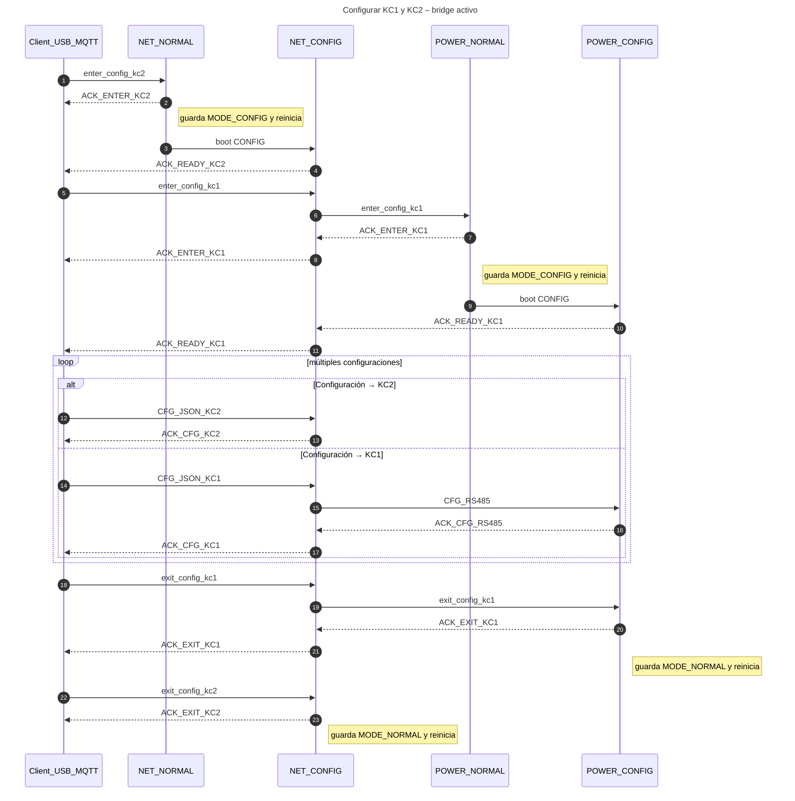

```mermaid

sequenceDiagram
    title Configurar KC1 y KC2 – bridge activo
    autonumber

    %% Participantes
    participant C     as Client_USB_MQTT
    participant KC2N  as NET_NORMAL
    participant KC2C  as NET_CONFIG
    participant KC1N  as POWER_NORMAL
    participant KC1C  as POWER_CONFIG

    %% A – KC2 pasa a modo configuración (puente)
    C  ->> KC2N : enter_config_kc2
    KC2N -->> C : ACK_ENTER_KC2
    Note right of KC2N: guarda MODE_CONFIG y reinicia
    KC2N ->> KC2C : boot CONFIG
    KC2C -->> C  : ACK_READY_KC2

    %% B – KC1 pasa a modo configuración, vía puente
    C  ->> KC2C : enter_config_kc1
    KC2C ->> KC1N : enter_config_kc1
    KC1N -->> KC2C : ACK_ENTER_KC1
    KC2C -->> C   : ACK_ENTER_KC1
    Note right of KC1N: guarda MODE_CONFIG y reinicia
    KC1N ->> KC1C : boot CONFIG
    KC1C -->> KC2C : ACK_READY_KC1
    KC2C -->> C    : ACK_READY_KC1

    %% C – Envío de configuraciones (alternar destino)
    loop múltiples configuraciones
        alt Configuración → KC2
            C  ->> KC2C : CFG_JSON_KC2
            KC2C -->> C : ACK_CFG_KC2
        else Configuración → KC1
            C  ->> KC2C : CFG_JSON_KC1
            KC2C ->> KC1C : CFG_RS485
            KC1C -->> KC2C : ACK_CFG_RS485
            KC2C -->> C   : ACK_CFG_KC1
        end
    end

    %% D – Salir de configuración en KC1
    C  ->> KC2C : exit_config_kc1
    KC2C ->> KC1C : exit_config_kc1
    KC1C -->> KC2C : ACK_EXIT_KC1
    KC2C -->> C    : ACK_EXIT_KC1
    Note right of KC1C: guarda MODE_NORMAL y reinicia

    %% E – Salir de configuración en KC2
    C  ->> KC2C : exit_config_kc2
    KC2C -->> C : ACK_EXIT_KC2
    Note right of KC2C: guarda MODE_NORMAL y reinicia


```
